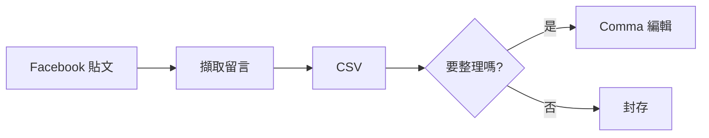

# Comma 預覽測試

一段 **粗體** 與 `code`，[外部連結](https://pele.run)。

| 欄位 | 說明 |
|---|---|
| A | 留言者 |

```mermaid
flowchart LR
  A[Facebook 貼文] --> B[擷取留言] --> C[CSV]
  C --> D{要整理嗎?}
  D -->|是| E[Comma 編輯]
  D -->|否| F[封存]
```

